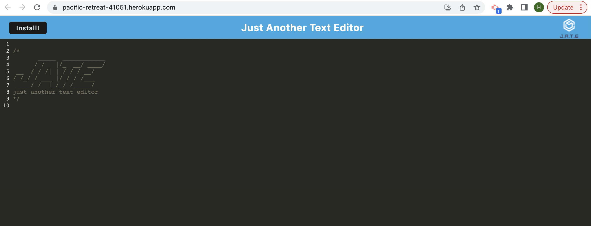

# Text Editor Starter Code
A website where a user can create notes or code snippets with or without an internet connection

## Links to the webpage and repository

To access the website use [Textinator](https://pacific-retreat-41051.herokuapp.com/)

To access the GitHub repository use [GitHub Repository textinator](https://github.com/Haruka08/textinator)

## Content

The website consists of following 2 main sections:

1. Main page
    - A blank page with a backgroud text shwoing JATE
    - Text can be extered anywhere on the page
    - Text can be viewed after closing the browser or offline

2. Install
    - The button allows the application to be installed onto the user PC
    - Opens up as an app
    - App has the same function as in browser and saves the text entered for later review

## Screenshot of the website

